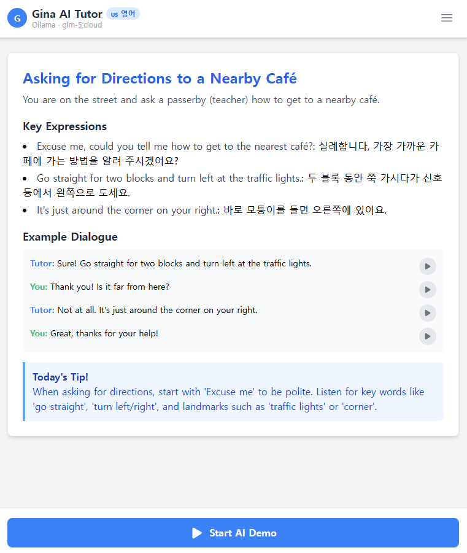
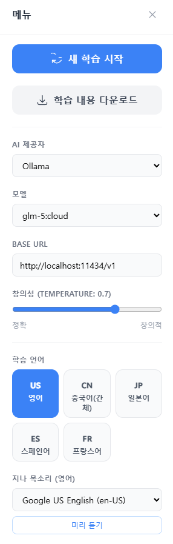
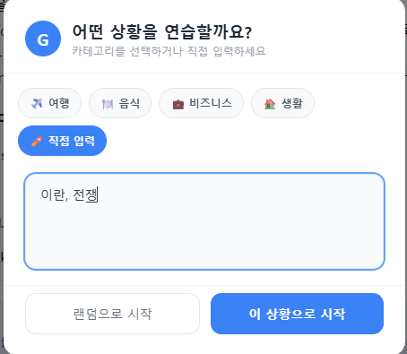

# Gina AI English Tutor

AI 기반 외국어 튜터 앱. 튜터 '지나'와 함께 8단계 학습 플로우(미션 제시 → 시연 → 롤플레이 → 피드백 → 응용 롤플레이 → 최종 피드백 → 쉐도잉 → 세션 완료)를 진행합니다.

## 지원 언어

영어, 중국어(간체), 일본어, 스페인어, 프랑스어

## 지원 AI 프로바이더

| 프로바이더 | 기본 모델 | 설정 방법 |
|---|---|---|
| Gemini | `gemini-2.0-flash` | `VITE_GEMINI_API_KEY` 환경변수 |
| OpenAI | `gpt-4o` | 설정 패널에서 API Key 입력 |
| Ollama | `qwen2.5-coder:latest` | 로컬 Ollama 실행 후 자동 감지 |
| Web Service | - | `VITE_AI_BASE_URL` 환경변수 |

## 로컬 실행

**필수 조건:** Node.js

1. 의존성 설치:
   ```
   npm install
   ```

2. 환경변수 설정 (`.env.local` 파일 생성):
   ```
   VITE_GEMINI_API_KEY=your_gemini_api_key

   # 선택 사항
   VITE_AI_PROVIDER=gemini          # gemini | openai | ollama | web-service
   VITE_AI_MODEL=gemini-2.0-flash
   VITE_AI_BASE_URL=http://localhost:8080/api/generate
   ```

3. 개발 서버 실행:
   ```
   npm run dev
   ```

## 주요 기능

- **8단계 구조화 학습**: 미션 제시부터 쉐도잉까지 단계별 진행
- **음성 인식/합성**: Web Speech API를 활용한 말하기 연습
- **다중 AI 프로바이더**: Gemini, OpenAI, Ollama, 외부 웹 서비스 지원
- **다국어 학습**: 5개 언어 선택 가능
- **설정 저장**: 브라우저 localStorage에 설정 자동 저장
- **대화 내보내기**: 세션 내용 다운로드

## 기술 스택

- React 19 + TypeScript
- Vite 6
- `@google/genai` SDK
- Web Speech API (SpeechRecognition, SpeechSynthesis)


## 화면

<table>
  <tr>
    <th align="center">플레이 화면</th>
    <th align="center">설정</th>
    <th align="center">대화 설정</th>
  </tr>
  <tr>
    <td align="center"></td>
    <td align="center"></td>
    <td align="center"></td>
  </tr>
</table>